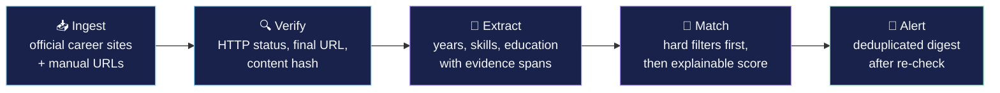

<div align="center">

# 🚗 AutoJob Intel

### Verified job intelligence with explainable matching

**Official-link job tracking for automotive, embedded, cybersecurity, and early-career roles — built on trust, not volume.**

[](https://nextjs.org/)
[](https://react.dev/)
[](https://www.typescriptlang.org/)
[](https://supabase.com/)
[](./LICENSE)

</div>

---

## 🎯 What is AutoJob Intel?

Most job aggregators optimize for **volume** — the more links they can show, the better they look.
AutoJob Intel optimizes for **trust**: every listing points to an official employer posting, every
requirement cites the exact sentence it came from, and every alert is re-verified as *active* before
it reaches you.

> **The build target:** a candidate configures a Michigan early-career search profile, adds official
> employer career sources, receives normalized jobs with extracted experience requirements, sees
> verification evidence and explainable fit, saves a job, and receives a deduplicated digest — only
> after a final active-link check.

---

## ✨ Highlights

| | Feature | What it means |
|---|---|---|
| 🔗 | **Official links only** | Every job points to the employer's own posting, not a re-hosted copy. |
| 🔍 | **Status verification** | Links are re-checked and marked `verified` · `uncertain` · `closed`. |
| 📄 | **Cited requirements** | Extracted years/skills/education quote the exact source sentence. |
| 🧭 | **Explainable fit** | Scores separate hard filters, matches, gaps, and unknowns — no black box. |
| 📨 | **Trustworthy digests** | Deduplicated alerts sent only after a final active-link re-check. |
| 🛡️ | **Compliant by design** | No CAPTCHA bypass, no logged-in scraping, no auto-apply, no fabricated links. |

---

## 🔄 How it works

Fetching and parsing stay **separate** from matching, so verified job records are reusable across
every candidate profile.



| Stage | Responsibility |
|-------|----------------|
| **Ingest** | Pull postings from official employer career sites and manually added job URLs. |
| **Verify** | Re-visit the canonical link; record HTTP status, final URL, and a content hash. |
| **Extract** | Normalize each posting and pull requirements — every claim cites its source sentence. |
| **Match** | Apply hard filters (location, seniority, experience) first, then score and explain skills. |
| **Alert** | Send a deduplicated digest after a final re-check; issue a correction when a job closes. |

---

## 🖥️ The prototype

The starter ships an interactive, mock-data dashboard so you can see the end goal before the backend
exists:

- **Search profile** — adjustable minimum-fit threshold and a *verified-active-only* filter.
- **Ranked openings** — fit score, verification tag, exact experience range, matched/gap chips, and
  the **source evidence** behind each posting.
- **Verification ledger** — per-job status and next-check timing.
- **Digest rules** — the trust guarantees applied before anything is sent.

It runs entirely on mock data — **no API keys required**.

---

## 🚀 Getting started

```bash
# 1. Requires Node.js 20.9+
node --version

# 2. Configure environment (optional for the mock demo)
cp .env.example .env.local

# 3. Install and run
npm install
npm run dev
```

Then open **http://localhost:3000**.

The starter runs on mock data without any API keys. Database and AI integrations are intentionally
left behind interfaces so they can be completed safely.

```bash
npm run dev        # start the dev server
npm run build      # production build
npm run typecheck  # strict TypeScript check
```

---

## 🗂️ Project structure

```
autojob-intel/
├── app/
│   ├── page.tsx           # Interactive dashboard (client component)
│   ├── layout.tsx         # Root layout + metadata
│   ├── globals.css        # Design system / styling
│   └── api/jobs/route.ts  # Jobs JSON endpoint
├── lib/
│   ├── types.ts           # Job / status types
│   └── mock-data.ts       # Seed data for the prototype
├── supabase/
│   └── schema.sql         # Normalized ingestion + matching schema
├── docs/                  # PRD, architecture, roadmap, security
└── CLAUDE_HANDOFF.md      # Implementation order + definition of done
```

---

## 🧱 Data model

The `supabase/schema.sql` defines a normalized pipeline schema:

`profiles` · `sources` · `jobs` · `job_requirements` · `verifications` · `matches` · `saved_jobs` · `notifications`

Job records are stored independently of matches so a single verified posting can be scored against
many candidate profiles.

---

## 🗺️ Roadmap

- **Phase 1** — Manual source registry, official URL ingestion, verifier, matcher, saved jobs, and one daily digest.
- **Phase 2** — Employer adapters, change detection, resume recommendation, application tracking.
- **Phase 3** — Career-center accounts, recruiter-side verified talent pools, labor-market analytics.

See [`docs/ROADMAP.md`](./docs/ROADMAP.md) and [`CLAUDE_HANDOFF.md`](./CLAUDE_HANDOFF.md) for the full implementation order.

---

## 🛡️ Trust & safety

AutoJob Intel treats imported job text as untrusted input and **never**:

- bypasses CAPTCHAs or bot defenses,
- performs logged-in / authenticated scraping,
- submits applications automatically,
- fabricates or re-hosts links, or
- claims comprehensive coverage.

It prefers official APIs, feeds, and structured data, and respects site terms, rate limits, and
robots directives. See [`docs/SECURITY.md`](./docs/SECURITY.md).

---

## 📚 Documentation

| Doc | Purpose |
|-----|---------|
| [`docs/PRD.md`](./docs/PRD.md) | Product requirements & quality metrics |
| [`docs/ARCHITECTURE.md`](./docs/ARCHITECTURE.md) | System architecture |
| [`docs/ROADMAP.md`](./docs/ROADMAP.md) | Phased roadmap |
| [`docs/SECURITY.md`](./docs/SECURITY.md) | Security & privacy baseline |
| [`CLAUDE_HANDOFF.md`](./CLAUDE_HANDOFF.md) | Implementation order & definition of done |

---

## 📄 License

Released under the [MIT License](./LICENSE).

<div align="center">
<sub>Built for candidates who would rather have five trustworthy leads than five hundred stale ones.</sub>
</div>
