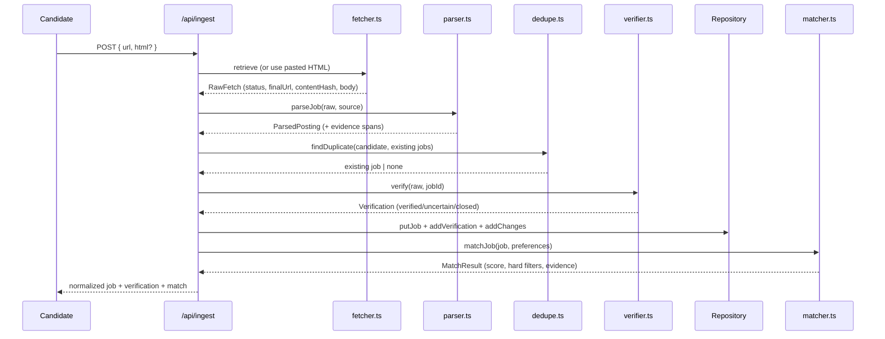

# Architecture

- Source adapters per employer/platform; respect robots, terms, rate limits, and public access.
- Fetcher saves raw evidence hash and retrieval metadata.
- Parser normalizes job records and extracts requirements with evidence spans.
- Deduper combines external IDs, canonical URLs, title/location/company similarity, and content hashes.
- Verifier revisits canonical URLs and evaluates active/closed signals.
- Matcher applies deterministic constraints before semantic/model scoring.
- Notification service uses idempotency keys and re-verifies immediately before send.

Use a queue for crawling and verification. Keep fetch/parsing separate from matching so job records are reusable across profiles.

## As implemented

Each stage above is a pure, independently testable module in `lib/`, wired together by
`lib/pipeline.ts`:

| Concern | Module |
|---------|--------|
| Retrieval | `fetcher.ts` — final URL, HTTP status, content hash, raw body; timeout, size cap, no auth |
| Parsing | `parser.ts` — schema.org `JobPosting` JSON-LD first, heuristic fallback; evidence spans |
| Dedup + history | `dedupe.ts` — URL / external id / hash / fuzzy match; field-level change diff |
| Verification | `verifier.ts` — active / closed / uncertain from status, markers, `validThrough` |
| Matching | `matcher.ts` — hard filters, then explainable 0–100 score |
| Digest | `digest.ts` — idempotent alerts + closed-job corrections |
| Domain types | `schema.ts` — one Zod source of truth |
| Persistence | `repository.ts` — interface + file/in-memory backends |

### Swapping the datastore

`Repository` (in `lib/repository.ts`) is the only persistence seam. The app ships with file-backed
and in-memory implementations. To move to Postgres/Supabase, implement the same public methods against
`supabase/schema.sql` and return it from `lib/config.ts#getRepository`. Nothing in the pipeline, API
routes, or UI needs to change.

### Adding delivery (email/Discord)

`generateDigest` returns structured `DigestItem`s and records `Notification`s with `dedupeKey`s for
idempotency. A delivery adapter only needs to render those items and call a provider (Resend, a
Discord webhook, …); re-verify by re-ingesting the affected sources immediately before sending, which
the pipeline already does on ingest.

### Scaling out

For production crawling, move `runIngestForSources` behind a queue and run verification on a schedule.
Because job records are stored independently of matches, verification and per-profile matching scale
separately.
